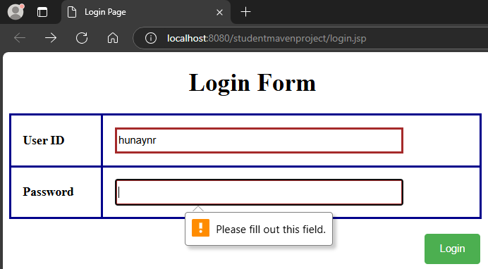

  <h3 align="center">Java Online Programming Test</h3>

<!-- TABLE OF CONTENTS -->

  
Table of Contents

  <ol>
    <li><a href="#login">Login</a></li>
    <li><a href="#welcome">Welcome</a></li>
  </ol>

<!-- LOGIN -->

## Login

This page allows user to enter the credentials in order to access the welcome page. The value of user id will be passed to the subsequent page therefore, each of the input field is set to a mandatory

<table>
  <tr>
    <td></td>
    <td></td>
  </tr>
  <tr>
    <td>

<b>Valid Input Data</b>

</td>
    <td>

<b>Invalid Input Data</b>

</td>
  </tr>
 </table>

(<a href="#readme-top">back to top</a>)

<!-- WELCOME -->

## Welcome

This page shows a set of student marks and their associated passing rate. The student is considered to be passed if they earn the mark value equals to or greater than 40, unless they are failed. A tiny pop-up window appears as the user click on the user id explaining the details of the corresponding user

<table>
  <tr>
    <td></td>
    <td></td>
  </tr>
  <tr>
    <td>

<b>Welcome Page</b>

</td>
    <td>

<b>a Pop-up Details Window</b>

</td>
  </tr>
 </table>

(<a href="#readme-top">back to top</a>)

